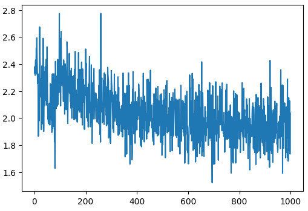

# nanoViT
Vision Transformer (ViT) implementations from scratch


---


## ViT Architecture

<p align="center">
  
</p>


---


## Progress


## Vision Transformer Model Configuration
```
n_layer    = 4
n_head     = 4
n_embd     = 768 
 
```


### Step 1 

**Training Configuration**
```
Max Iterations = 100 
Learning Rate  = 3e-4  
Batch Size     = 32  

MNIST Dataset :
image size     = 28 x 28 
image channels = 1
patch size     = 4 x 4
```

<table>
  <tr>
    <td valign="top" width="50%">
      <h4>Training Results</h4>
      <pre>
 0/100   2.1963953971862793
10/100   2.7260947227478027
20/100   2.0315542221069336
30/100   1.3844249248504639
40/100   1.2787163257598877
50/100   0.9120548367500305
60/100   1.3939018249511719
70/100   1.0994621515274048
80/100   0.7976328730583191
90/100   0.8562922477722168
      </pre>
    </td>
    <td valign="top" width="50%">
      <h4>Loss Curve</h4>
      
    </td>
  </tr>
</table>


---
### Step 2

- Trained on T4 GPU (free Google Colab)

**Techniques**
```
Flash Attention
Dropouts 

torch.compile() : kernel fusion
fused optimizer (AdamW)
```


**Training Configuration**
```
Max Iterations = 1000
Learning Rate  = 3e-4  
Batch Size     = 32  

MNIST Dataset :
image size     = 28 x 28 
image channels = 1
patch size     = 4 x 4
```

<table>
  <tr>
    <td valign="top" width="50%">
      <h4>Training Results</h4>
      <pre>
0/1000  2.2685  131.6884 ms
100/1000  0.8162  88.0437 ms
200/1000  0.9531  85.7632 ms
300/1000  2.0218  89.4675 ms
400/1000  0.7352  87.0714 ms
500/1000  0.4921  83.8625 ms
600/1000  0.7189  87.1720 ms
700/1000  0.7873  88.3372 ms
800/1000  0.9585  88.5544 ms
900/1000  0.7969  86.7596 ms
Time for just one iteration
      </pre>
    </td>
    <td valign="top" width="50%">
      <h4>Loss Curve</h4>
      
    </td>
  </tr>
</table>

**Validation accuracy**
- 0.8095


---


### Step 3

- Above model for CIFAR10 Trained on T4 GPU


**Training Configuration**
```
Max Iterations = 1000
Learning Rate  = 3e-4  
Batch Size     = 32  

CIFAR10 Dataset :
image size     = 32 x 32 
image channels = 3
patch size     = 8 x 8 
```

<table>
  <tr>
    <td valign="top" width="50%">
      <h4>Training Results</h4>
      <pre>
100/1000  2.3094  40.5657 ms
200/1000  2.1336  37.4801 ms
300/1000  2.3655  38.1184 ms
400/1000  1.8908  39.4473 ms
500/1000  1.8144  38.4216 ms
600/1000  1.7888  39.7465 ms
700/1000  2.0120  39.7189 ms
800/1000  1.7470  40.0531 ms
900/1000  1.9166  40.8957 ms
Time for just one iteration
      </pre>
    </td>
    <td valign="top" width="50%">
      <h4>Loss Curve</h4>
      
    </td>
  </tr>
</table>

**Validation accuracy**
- 0.2684
- Need to Improve


---


### Step 4 
- Training Techniques
- LR Schedule 
- Weight Decay : AdamW (decoupled Adam)
- Gradient Clipping

**Training Configuration**
```
Max Iterations = 1000 
Batch Size     = 32  

CIFAR10 Dataset :
image size     = 32 x 32 
image channels = 3
patch size     = 8 x 8 
```


<table>
  <tr>
    <td valign="top" width="50%">
      <h4>Training Results</h4>
      <pre>
0/1000  2.3342  23087.0581 ms   norm:7.0133   lr:1.2000e-05
100/1000  2.4822  37.9224 ms   norm:7.2206   lr:7.9537e-04
200/1000  2.5106  40.9629 ms   norm:6.9095   lr:7.5307e-04
300/1000  2.3512  37.1890 ms   norm:7.1988   lr:6.8768e-04
400/1000  1.9129  38.3921 ms   norm:5.2334   lr:6.0628e-04
500/1000  1.8971  36.9473 ms   norm:5.1916   lr:5.1770e-04
600/1000  1.8100  37.8897 ms   norm:3.7129   lr:4.3154e-04
700/1000  1.9884  37.7500 ms   norm:3.8145   lr:3.5713e-04
800/1000  1.8460  40.1011 ms   norm:3.9867   lr:3.0254e-04
900/1000  1.8357  37.7097 ms   norm:3.8326   lr:2.7368e-04
Time for just one Iteration
      </pre>
      <h4>LR Schedule: Warm up + Cosine decay</h4>
      
    </td>
    <td valign="top" width="50%">
      <h4>Loss Curve</h4>
      
      <h4>Norms</h4>
      
    </td>
  </tr>
</table>

**Validation accuracy**
```
0.2956 : Batch Size = 32
```

---


## Step 5

- Change Config , Increase max_iter and Train

### Vision Transformer Model Configuration
```
n_layer    = 8
n_head     = 8
n_embd     = 1024

Total parameters = 101.000586 M
 
```

**Training Configuration**
```
Max Iterations = 10000
Batch Size     = 32  

CIFAR10 Dataset :
image size     = 32 x 32 
image channels = 3
patch size     = 8 x 8 
```


<table>
  <tr>
    <td valign="top" width="50%">
      <h4>Training Results</h4>
      <pre>
0/10000  2.5523  187.0518 ms   norm:10.4012   lr:1.2000e-06
1000/10000  1.9406  132.7546 ms   norm:5.6361   lr:7.9537e-04
2000/10000  1.8547  131.8426 ms   norm:3.7117   lr:7.5307e-04
3000/10000  1.9597  132.9753 ms   norm:10.2523   lr:6.8768e-04
4000/10000  1.8329  135.6885 ms   norm:1.9468   lr:6.0628e-04
5000/10000  1.8347  132.1881 ms   norm:2.7930   lr:5.1770e-04
6000/10000  1.8799  131.2051 ms   norm:1.9949   lr:4.3154e-04
7000/10000  1.7693  133.7743 ms   norm:2.2332   lr:3.5713e-04
8000/10000  1.4898  135.7555 ms   norm:3.1812   lr:3.0254e-04
9000/10000  1.7591  130.5749 ms   norm:2.8663   lr:2.7368e-04
Time for just one Iteration
      </pre>
    </td>
    <td valign="top" width="50%">
      <h4>Loss Curve</h4>
      
      <h4>Norms</h4>
      
    </td>
  </tr>
</table>

**Validation accuracy**
```
0.3665 : Batch Size = 32
```


---


## Step 6

- Change Config Train
- Automatix Mixed Precision : FP16
- Gradient Scaling

### Vision Transformer Model Configuration
```
n_layer    = 4
n_head     = 4
n_embd     = 512

Total parameters = 12.67569 M
```


**Training Configuration**
```
Max Iterations = 10000
Batch Size     = 32  
Dropout        = 0.1
Weight Decay   = 0.1

CIFAR10 Dataset :
image size     = 32 x 32 
image channels = 3
patch size     = 4 x 4   **
```


<table>
  <tr>
    <td valign="top" width="50%">
      <h4>Training Results</h4>
      <pre>
0/10000  2.4279  27325.5315 ms   norm:258095.5469   lr:3.0000e-07
100/10000  2.2323  132.4365 ms   norm:97890.0156   lr:3.0300e-05
200/10000  2.1970  129.8618 ms   norm:132378.7188   lr:6.0300e-05
300/10000  2.1507  126.5490 ms   norm:193911.8438   lr:9.0300e-05
400/10000  2.1040  175.8697 ms   norm:102937.4297   lr:1.2030e-04
500/10000  1.9755  130.6367 ms   norm:183109.0625   lr:1.5030e-04
600/10000  1.9071  263.5031 ms   norm:176709.8750   lr:1.8030e-04
700/10000  1.9249  133.0395 ms   norm:240990.4844   lr:2.1030e-04
800/10000  1.8831  139.6286 ms   norm:217091.4531   lr:2.4030e-04
900/10000  1.6804  135.7474 ms   norm:218510.4219   lr:2.7030e-04
1000/10000  1.5870  128.8788 ms   norm:176226.6250   lr:3.9686e-04
.....
9000/10000  1.2624  127.7118 ms   norm:485413.4375   lr:1.3500e-04
9100/10000  1.4049  136.4555 ms   norm:422169.5625   lr:1.3508e-04
9200/10000  1.2464  139.4420 ms   norm:387054.4375   lr:1.3533e-04
9300/10000  1.1008  164.9494 ms   norm:417613.7812   lr:1.3574e-04
9400/10000  1.2119  136.7428 ms   norm:425827.2188   lr:1.3631e-04
9500/10000  1.1485  128.3889 ms   norm:496879.4375   lr:1.3705e-04
9600/10000  1.0940  129.1959 ms   norm:424232.7812   lr:1.3795e-04
9700/10000  1.2520  127.5260 ms   norm:465371.5312   lr:1.3901e-04
9800/10000  1.3177  132.9041 ms   norm:482720.0000   lr:1.4023e-04
9900/10000  1.3293  137.9173 ms   norm:454690.4062   lr:1.4161e-04
Time for just one Iteration
      </pre>
    </td>
    <td valign="top" width="50%">
      <h4>Loss Curve</h4>
      
      <h4>Norms</h4>
      
    </td>
  </tr>
</table>

**Validation accuracy**
```
0.6481 : Batch Size = 32
```

---

## Step 7

- Trained in Rtx 4080 16GB
- Data Augmentation
- Fused Kernels

### Vision Transformer Model Configuration
```
ViT Base
n_layer    = 12
n_head     = 12
n_embd     = 768
mlp_hidden = 4 * n_embd

Total parameters = ~86M
```


**Training Configuration**
```
Max Iterations = 400000
Batch Size     = 32  
Warmup Ratio   = 0.05     (LR Schedule: Warmup + Cosine Decay)
Max lr         = 3e-4     (Min lr = 3e-5)
Dropout        = 0.1
Weight Decay   = 0.1      (Optimizer AdamW)
Gradint Clip   = 1.0
```
[IMAGENET100 Dataset](https://huggingface.co/datasets/clane9/imagenet-100):
```
image size     = 224 x 224 
image channels = 3
patch size     = 16 x 16   **
```


<table>
  <tr>
    <td valign="top" width="50%">
      <h4>Training Results</h4>
      
    </td>
    <td valign="top" width="50%">
      <h4>Loss Curve</h4>
      
    </td>
  </tr>
</table>

- Min Train Loss: 1.8e-05
- Min Validation Loss: 1.1369
- Best model checkpoint : 300000 step

Next **Evaluation** 


---
- Minimum val loss model (300000 step)
- {'top1_accuracy': 70.58, 'top5_accuracy': 90.42}

- SWA model for 5 chechpoints: 280K - 330K .pt
- {'top1_accuracy': 74.22, 'top5_accuracy': 91.60}

- SWA model for 10 chechpoints: 250K - 350K .pt
-{'top1_accuracy': 74.26, 'top5_accuracy': 91.88}

- SWA model last 13 checkpoints : 280K - 399999 .pt
- {'top1_accuracy': 74.46, 'top5_accuracy': 91.52}

- SWA model last 5 checkpoints
- {'top1_accuracy': 74.42, 'top5_accuracy': 91.12}
---


### Attention Visualization
- Attention Rollout Algorithm

<p align="center">
  
</p>
<p align="center">
  
</p>

---


## References
- [An Image is Worth 16x16 Words: Transformers for Image Recognition at Scale](https://arxiv.org/pdf/2010.11929)
